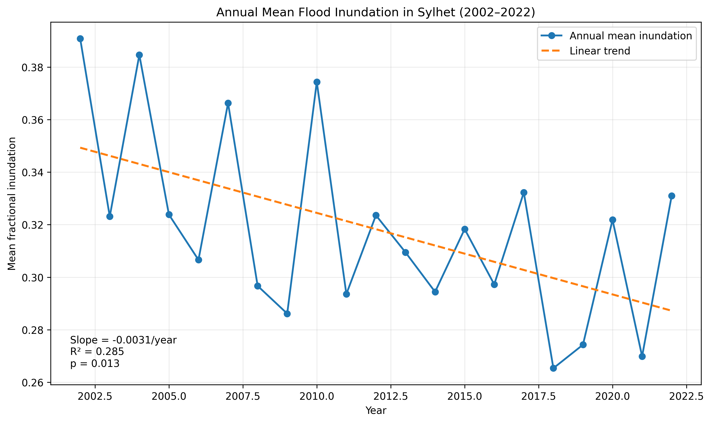

# Flood Risk Analysis

A reproducible geospatial and machine-learning workflow for flood susceptibility analysis and flood-risk-oriented mapping using terrain, hydrological, environmental, and rainfall-related variables.

> **Project status:** Active research prototype. Historical inundation processing for Sylhet Division has been completed using 975 observations spanning 2001–2022. A reproducible time-series dataset, spatial outputs, and preliminary trend analysis are now available in this repository.
## Key Results

- Processed **975 historical inundation rasters** covering **2001–2022**.
- Generated a reproducible Sylhet Division flood-inundation time series.
- Annual mean inundation for **2002–2022** shows a statistically significant decreasing trend.
- Linear trend: **slope = -0.0031/year**, **R² = 0.285**, **p = 0.013**.
- Kendall trend test: **τ = -0.324**, **p = 0.042**.
- The result indicates a declining trend in modeled fractional inundation over the study period; it should not be interpreted as a complete reduction in flood risk because exposure and vulnerability are not included.


## Project Overview

Flooding is a major environmental hazard that can affect communities, infrastructure, agriculture, and ecosystems. This project develops a transparent and reproducible workflow for identifying flood-prone areas from spatial data and data-driven models.

The technical workflow is designed to combine:

- Digital Elevation Model (DEM) processing
- Terrain and hydrological feature extraction
- Rainfall-related variables
- Land-cover information
- Proximity-to-drainage features
- Machine-learning classification
- Model evaluation and interpretation
- Spatial prediction and mapping
## Data Source

Historical inundation data are derived from the **Bangladesh Inundation History** dataset published through CyVerse Data Commons.

- **Dataset:** Bangladesh Inundation History
- **DOI:** 10.25739/2edm-jh03
- **Spatial resolution:** approximately 500 m
- **Temporal resolution:** approximately 8-day intervals
- **Coverage:** 2001–2022
- **Study area used here:** Sylhet Division, Bangladesh
- **Processed observations:** 975 inundation rasters

The national-scale inundation rasters were downloaded programmatically and clipped to the validated Sylhet Division boundary. The resulting Sylhet-specific rasters were used to construct the historical inundation time series analyzed in this repository.

The processed summary dataset is available at:

`data/processed/sylhet_flood_timeseries.csv`
### Terminology note

Strictly speaking, **flood risk** includes not only the probability or intensity of flooding, but also **exposure** and **vulnerability**. The initial modeling stage of this repository therefore focuses primarily on **flood susceptibility / flood occurrence probability**. Exposure and vulnerability layers can be integrated later if a complete risk assessment is required.
## Implemented Methodology

The historical inundation analysis follows a reproducible geospatial workflow:

1. Download Bangladesh-scale fractional inundation GeoTIFFs from the Bangladesh Inundation History dataset.
2. Use a validated Sylhet Division boundary in EPSG:4326.
3. Clip each national raster to the Sylhet Division boundary.
4. Preserve raster NoData values and calculate statistics using valid pixels only.
5. Process 975 Sylhet-specific inundation rasters covering 2001–2022.
6. Calculate date-level summary metrics, including mean, median, maximum inundation and inundation-threshold percentages.
7. Aggregate the observations by year to estimate annual mean fractional inundation.
8. Exclude 2001 from the annual trend test because the available record begins in September 2001.
9. Evaluate the 2002–2022 trend using linear regression and Kendall's tau test.

The complete processed time series is stored in:

`data/processed/sylhet_flood_timeseries.csv` 

## Reproducibility

The historical inundation workflow is implemented with version-controlled Python scripts in this repository.

Key scripts:

- `src/data/download_sylhet_boundary.py` — obtains and validates the Sylhet Division boundary.
- `src/data/process_flood_history.py` — discovers, downloads, clips, and processes the historical inundation rasters.

Python dependencies are listed in `requirements.txt`.

Generated summary data are stored in:

`data/processed/sylhet_flood_timeseries.csv`

Research figures are stored in:

`results/figures/`

Large source and intermediate raster collections are not committed to GitHub. They can be regenerated from the documented public data source using the processing workflow.

## Limitations

The current results should be interpreted as an analysis of modeled fractional inundation rather than a complete flood-risk assessment.

The Bangladesh Inundation History product is a model-derived dataset and therefore inherits uncertainty from its source observations and modeling procedure. The present trend analysis summarizes inundation over the entire Sylhet Division and does not yet quantify local spatial variability, flood depth, economic exposure, population exposure, or vulnerability.

The 2001 record is incomplete because the available time series begins in September; therefore, 2001 is excluded from the 2002–2022 annual trend test.

The observed decreasing trend does not by itself demonstrate that flood hazard or flood risk has decreased. Additional hydroclimatic, terrain, land-cover, exposure, and vulnerability variables are required for a broader risk assessment.
## Research Questions

1. Which geospatial, terrain, hydrological, and rainfall-related variables contribute most strongly to flood susceptibility prediction?
2. How accurately can supervised machine-learning models distinguish flood-prone from non-flood-prone locations, or estimate flood-susceptibility classes when an appropriate labeled dataset is available?
3. How does predictive performance change when different combinations of terrain, rainfall, land-cover, and proximity variables are used?
4. How strongly do validation results depend on the train-test strategy, particularly when spatial separation is used to reduce spatial leakage?
5. Can the final workflow generate interpretable and reproducible susceptibility maps suitable for further hydrological and environmental analysis?

## Core Workflow

```text
Raw Spatial Data
      |
      v
Data Validation and Cleaning
      |
      v
DEM and Terrain Processing
      |
      v
Hydrological Feature Extraction
      |
      v
Rainfall / Land-Cover / Proximity Features
      |
      v
Raster Alignment and Feature Engineering
      |
      v
Spatially Aware Train / Validation Split
      |
      v
Machine-Learning Models
      |
      v
Performance Evaluation
      |
      v
Model Interpretation and Error Analysis
      |
      v
Flood-Susceptibility Mapping
```

## Candidate Predictor Variables

The final feature set will depend on data availability and scientific relevance.

| Category | Candidate Variables |
|---|---|
| Terrain | elevation, slope, aspect |
| Hydrology | flow direction, flow accumulation, drainage density |
| Rainfall | rainfall intensity, accumulated precipitation |
| Surface characteristics | land cover, vegetation-related variables |
| Proximity | distance to rivers, streams, or drainage channels |
| Derived spatial features | topographic wetness-related indicators, normalized terrain metrics |

Every variable used in an experiment will be documented with its source, spatial resolution, coordinate reference system, preprocessing procedure, and role in the model.

## Modeling Strategy

The project is structured to compare multiple supervised-learning methods under a consistent preprocessing and validation framework.

Candidate models include:

- Logistic Regression as an interpretable baseline
- Random Forest
- Gradient-Boosted Trees
- Support Vector Machine

Model selection will be based on validated empirical performance, stability, interpretability, and suitability for the available dataset rather than on model complexity alone.

## Evaluation Strategy

Evaluation will be selected according to the final target definition and class distribution. Candidate metrics include:

- Precision
- Recall
- F1-score
- ROC-AUC
- PR-AUC when class imbalance is substantial
- Confusion matrix
- Balanced accuracy
- Cross-validation statistics
- Feature-importance or model-interpretation outputs

A major methodological concern is **spatial autocorrelation**. Randomly splitting nearby pixels or points can produce overly optimistic results because neighboring samples may be highly similar. For that reason, the project will prioritize **spatially separated holdout sets or spatial/block cross-validation** when the dataset supports them.

## Repository Structure

```text
flood-risk-analysis/
├── README.md
├── LICENSE
├── .gitignore
├── requirements.txt
├── data/
│   ├── raw/
│   ├── interim/
│   └── processed/
├── notebooks/
├── src/
│   ├── data/
│   ├── features/
│   ├── models/
│   └── visualization/
├── tests/
├── results/
│   ├── figures/
│   ├── metrics/
│   └── maps/
└── docs/
```

## Reproducibility Principles

The project is developed under the following reproducibility rules:

1. Raw source data remain separate from derived and processed data.
2. Data cleaning and feature engineering are performed through documented code.
3. Coordinate reference systems, raster resolution, spatial extent, and resampling choices are explicitly recorded.
4. Model parameters and random seeds are saved where applicable.
5. Evaluation metrics are generated programmatically.
6. Figures and maps are generated from saved analysis outputs.
7. No quantitative performance result is reported unless it comes from an executed experiment.
8. Large or redistribution-restricted datasets are not committed directly; instead, their sources and preparation instructions are documented.
9. Final evaluation data are kept separate from model-development decisions to reduce information leakage.

## Development Plan

### Stage 1: Project foundation

- Repository structure
- Environment configuration
- Data-validation utilities
- Reproducible preprocessing pipeline

### Stage 2: Geospatial preprocessing

- DEM loading and validation
- Coordinate-reference-system checks
- Terrain-variable generation
- Raster alignment and resampling
- Missing-data handling

### Stage 3: Hydrological feature engineering

- Flow-related variables
- Stream or drainage proximity
- Watershed-related spatial features
- Derived terrain-hydrology indicators

### Stage 4: Machine-learning experiments

- Interpretable baseline model
- Tree-based models
- Hyperparameter tuning
- Spatial validation
- Model comparison

### Stage 5: Interpretation and mapping

- Feature importance or model interpretation
- Error analysis
- Flood-susceptibility probability mapping
- Uncertainty and limitation assessment
- Reproducible final outputs

## Scientific Considerations

Flood-susceptibility modeling is sensitive to data quality, spatial resolution, class imbalance, temporal mismatch among datasets, label uncertainty, and validation design.

Special attention is therefore given to:

- avoiding target and spatial leakage
- using consistent coordinate reference systems
- checking raster resolution, extent, and alignment
- handling missing values explicitly
- documenting flood-label definitions
- evaluating class imbalance
- separating exploratory analysis from final evaluation
- distinguishing predictive association from physical causation
- reporting uncertainty and methodological limitations

## Installation

Clone or download the repository, open a terminal in the project directory, and create a virtual environment:

```bash
python -m venv .venv
```

Activate the environment, then install the project dependencies:

```bash
pip install -r requirements.txt
```

The exact dependency versions will be pinned in `requirements.txt` as the implementation is finalized.

## Usage

Executable scripts and notebooks will be documented as they are added. The goal is for each major processing step to be reproducible from code rather than relying on undocumented manual GIS operations.

## Results

Results will be added only after the experiments have been executed and checked. Planned outputs include:

- model-comparison tables
- confusion matrices
- ROC and precision-recall curves
- feature-importance or interpretation plots
- flood-susceptibility maps
- error-analysis summaries
- computational performance information

**No placeholder or fabricated accuracy values are reported in this repository.**

## Limitations

Expected limitations may include:

- uncertainty in flood-event labels
- incomplete temporal coverage
- differences in spatial resolution among source datasets
- spatial autocorrelation
- class imbalance
- temporal mismatch between predictor and target data
- limited transferability across geographic regions
- uncertainty introduced by preprocessing choices

The limitations section will be revised after the final dataset and experiments are established.

## Future Work

Possible extensions include:

- event-based flood forecasting
- temporal deep-learning models
- physically informed machine learning
- uncertainty quantification
- explainable AI for spatial predictions
- integration of exposure and vulnerability layers for full flood-risk assessment
- comparison across multiple watersheds or geographic regions

## Author

**Jeba Fariha Islam**

Research project in geospatial analysis, hydrology, environmental modeling, and machine learning.

## License

A license will be added before the repository is finalized for public reuse.
